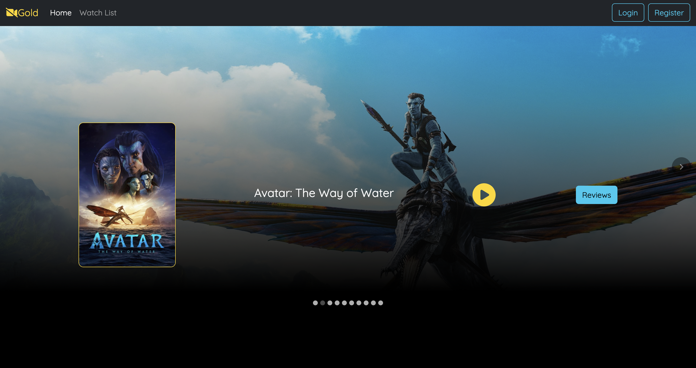
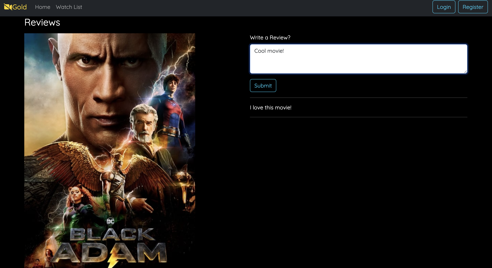

# ReactSpringBootMovieFullStack

Welcome to the Movie Review Web Application! This is a small web application that allows users to browse movie information, leave reviews, and watch official trailers.

## Technologies

- Backend: Spring Boot
- Frontend: React
- Database: MongoDB

## Features

- **Browse Movies**: Users can view a list of movies and get detailed information about each movie.

- **Leave Reviews**: Registered users can leave reviews for movies and read reviews from other users.

- **Watch Trailers**: Users can watch official movie trailers directly on the site.

